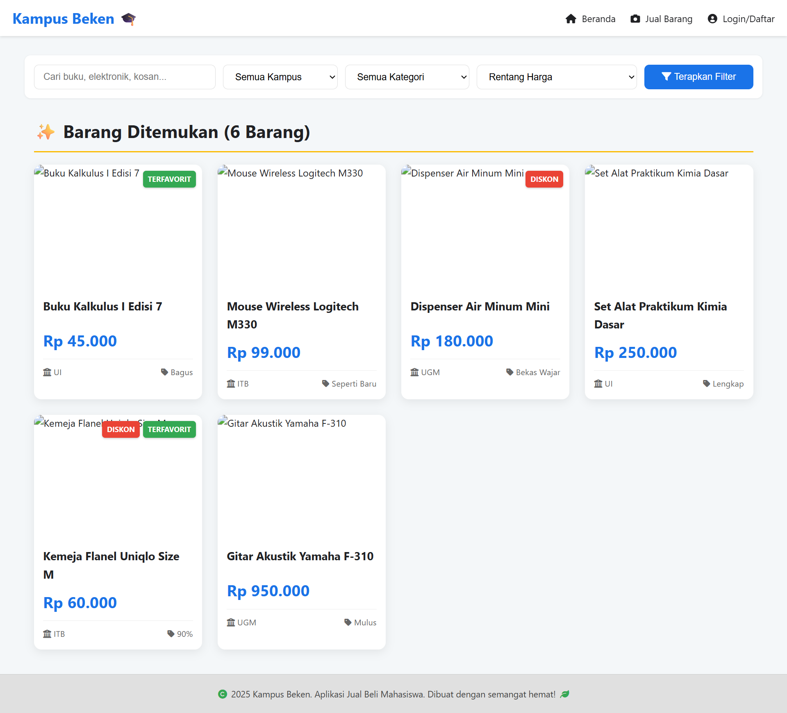

# 🛒 Aplikasi Jual Beli Barang Bekas Mahasiswa: Kampus Beken

---

### 📝 Deskripsi Singkat Proyek

Proyek ini adalah implementasi *Front-End* dari aplikasi web jual beli barang bekas yang ditujukan khusus untuk kalangan mahasiswa di berbagai kampus. Aplikasi ini dirancang sebagai **Single Page Application (SPA) dasar** menggunakan HTML, CSS, dan JavaScript murni.

**Fitur Utama:**

* **Pencarian & Filter:** Filter produk berdasarkan kampus, kategori, dan rentang harga.
* **Listing Produk:** Menampilkan barang-barang bekas yang diposting oleh mahasiswa.
* **Simulasi Login & Cart:** Logika autentikasi dan keranjang belanja disimulasikan menggunakan `localStorage`.
* **Post Item:** Fitur bagi pengguna terautentikasi untuk menjual barang mereka.

---

### 💻 Tampilan Aplikasi (Screenshot)

Berikut adalah tangkapan layar utama dari tampilan *dashboard* aplikasi **Kampus Beken**.

---

### 🔗 Tautan Desain dan Flow

Desain dan alur kerja aplikasi ini dibuat menggunakan Figma sesuai dengan instruksi yang diberikan.

| Jenis Dokumen | Tautan Akses |
| :--- | :--- |
| **Flowchart / Wireframe** | [Akses Flow Diagram (Figma Board)](https://www.figma.com/board/il3FWRBAPs5dDh6dkb4JnD/Wireframe-UTS?node-id=0-1&t=ruNQm68jriD2Vxq8-1) |
| **Desain UI/UX Lengkap** | [Akses Desain (Figma Design)](https://www.figma.com/design/rj4zyBAshjPqnnIHBflM9W/Desain-UTS?node-id=19-85&t=4o58BZ8VEW7b4mxY-1) |

---
